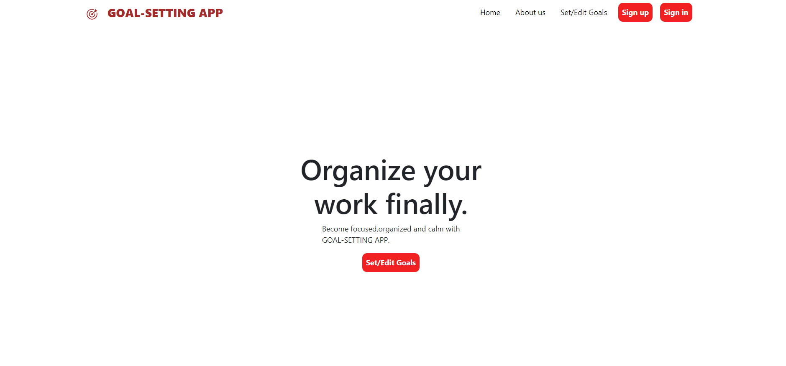
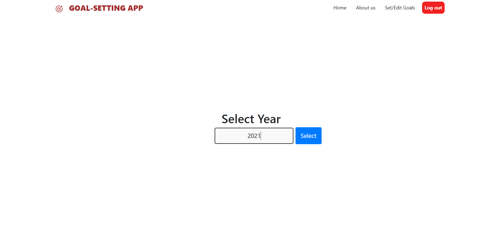
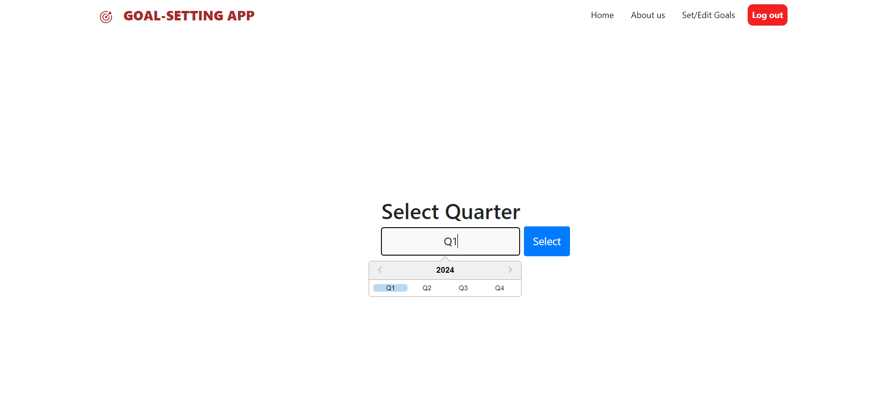
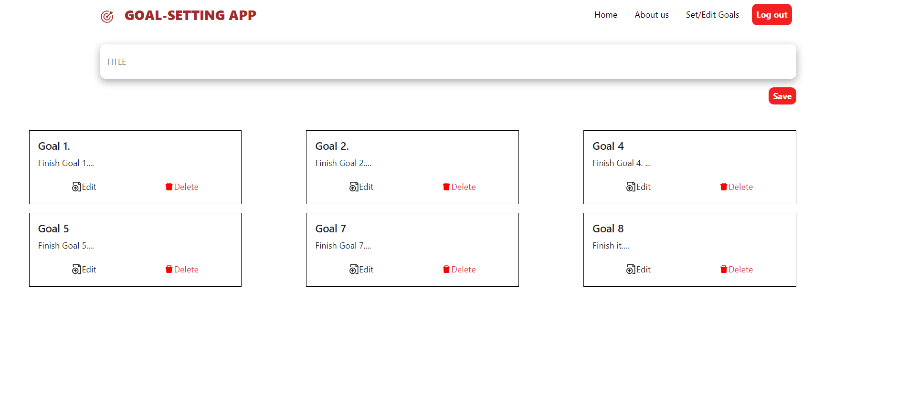
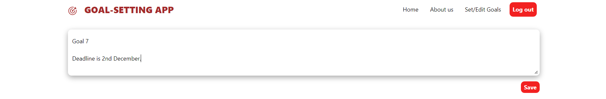
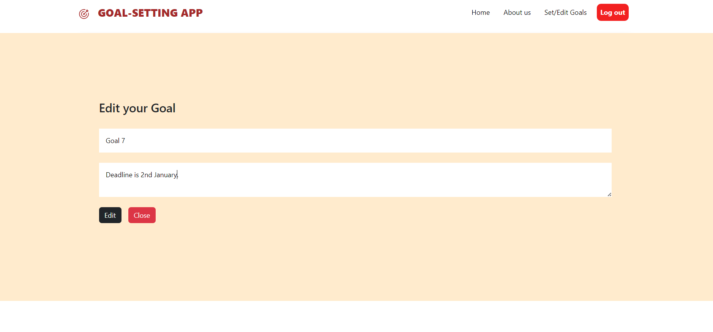
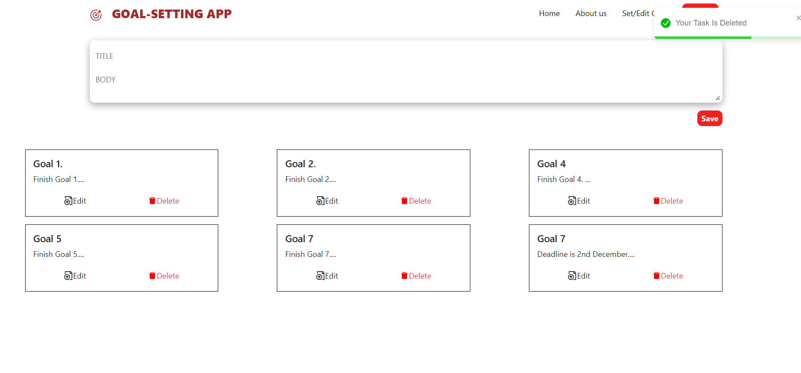

Employee Goal Tracker Prototype

A web-based prototype application for employees to set, track, and manage performance goals.

Employees can sign up and sign in to access a personal dashboard, select a year and quarter, and manage goals. Each goal has a title and description, displayed in interactive cards. Data is securely stored in MongoDB, and only authenticated users can manage their goals.

🔥 Features

- User Authentication: Secure sign-up and sign-in system.

- Goal Management: Create, read, update, and delete goals.

- Time-Based Organization: View goals by year and quarter.

- Interactive UI: Goals displayed in cards for easy access.

- Secure Backend: Data stored in MongoDB, accessible only to signed-in users.

🛠️ Tech Stack

Frontend: React.js, HTML, CSS

Backend: Node.js, Express.js

Database: MongoDB

📂 Project Structure

```
employee-goal-tracker-prototype/
├─ backend/         # Node.js & Express backend
│  ├─ models/       # MongoDB models
│  ├─ routes/       # API routes
│  ├─ app.js        # Backend entry point
│  └─ db.js         # MongoDB connection
├─ frontend/        # React frontend
│  ├─ src/          # React components and pages
│  └─ public/       # HTML and static assets
├─ .gitignore       # Ignored files like node_modules and build folders
└─ README.md        # Project documentation
```
🚀 Getting Started

Prerequisites

Node.js

MongoDB

Installation:
```bash
# Clone the repo
git clone https://github.com/khandelwalketan/employee-goal-tracker-prototype.git
cd employee-goal-tracker-prototype

# Install backend dependencies
cd backend
npm install

# Install frontend dependencies
cd ../frontend
npm install
```
Running the Application
```bash
# Start backend server
cd ../backend
npm start

# Start frontend development server
cd ../frontend
npm start
```
📸 Demo Screenshots

### Dashboard



### Select Year



### Select Quarter



### Goals View


### Add / Edit / Delete Goal




⚖️ License

This project is open-source and free to use.
